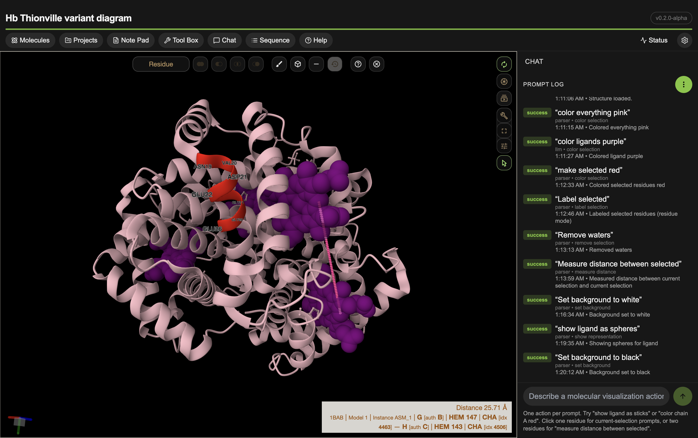
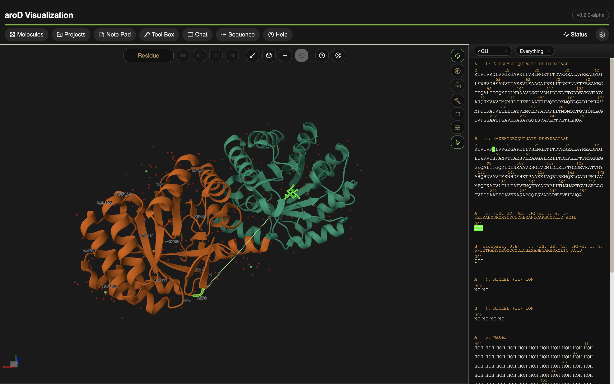

# NexMol

NexMol is the standalone pivot of the former PyMOL AI Assistant project. The current build runs as an Electron desktop app with a React + Mol* viewer and a FastAPI backend for AI, config, and structure-data services.

## Download

End users should download packaged builds from [GitHub Releases](https://github.com/varunsharm16/pymol_ai_assistant/releases).

Packaged alpha builds bundle the NexMol backend. End users should not need to install Python, Node.js, or npm separately.

Current macOS release asset: `NexMol-0.2.1-alpha-arm64.dmg`
Current Windows release asset: `NexMol-0.2.1-alpha-win-x64.exe`

## Install on macOS

1. Download the latest macOS `.dmg` release asset from [GitHub Releases](https://github.com/varunsharm16/pymol_ai_assistant/releases).
2. Open the DMG and drag `NexMol.app` into `Applications`.
3. If macOS blocks the first launch, open Terminal and run:

```bash
xattr -dr com.apple.quarantine /Applications/NexMol.app
```

4. Launch `NexMol` from `Applications`.
5. Open Settings and enter your OpenAI API key.

Note: the current macOS alpha build is signed, but Apple notarization is still pending. Until that is complete, macOS may show a protection warning on first launch.

## Windows

1. Download the latest Windows `x64` installer `.exe` from [GitHub Releases](https://github.com/varunsharm16/pymol_ai_assistant/releases).
2. Run the installer.
3. If Windows shows `Windows protected your PC`, click `More info`, then `Run anyway`.
4. Launch `NexMol`.
5. Open Settings and enter your OpenAI API key.

## Screenshots

Natural-language molecular visualization in the desktop app:



Sequence-aware molecular viewing in the desktop app:



## Current Status

This branch is a staged weekend stabilization build.

Working now:

- Electron desktop shell
- browser dev mode is still experimental
- PDB fetch
- local structure import
- prompt log
- API key configuration
- project save/load with embedded structure data
- core Mol*-backed viewer commands with project scene replay

Staged but not fully implemented yet:

- alignment
- polar contacts

These staged features are intentionally preserved in the parser and command model. They may be accepted by the app and surfaced as not yet implemented rather than removed.

## Architecture

```text
Electron (React + Mol*)  <--HTTP-->  FastAPI backend
```

- Frontend executes viewer commands directly.
- Backend handles LLM prompting, config, validation, and structure-data access.
- Electron starts the backend on an ephemeral localhost port and passes that port to the frontend through IPC.

## Build from Source

### Requirements

- Python 3.8+
- Node.js 18+
- npm
- OpenAI API key

Recommended checks:

```bash
python3 --version
node --version
npm --version
```

On Windows:

```powershell
python --version
node --version
npm --version
```

### Development Setup

Backend:

```bash
cd pymol-bridge
python3 -m venv .venv
source .venv/bin/activate
pip install -r requirements.txt
```

Frontend:

```bash
cd pymol-ai-electron-ui
npm install
```

### Running NexMol

Desktop app:

```bash
cd pymol-ai-electron-ui
npm run dev
```

Browser dev mode:

1. Start the backend manually:

```bash
cd pymol-bridge
.venv/bin/python main.py
```

2. Note the printed `NEXMOL_PORT=<port>` value.
3. Start the frontend:

```bash
cd pymol-ai-electron-ui
npm run dev
```

4. Open the Vite URL with `?port=<port>`.

Example:

```text
http://localhost:5173/?port=51234
```

## Features

## Command Capability Matrix

Supported now:

- show/hide representation
- isolate selection
- remove selection as non-destructive hide/filter
- color selection
- color by chain
- color by element
- set transparency
- label selection
- zoom/orient selection
- measure distance
- set background
- rotate view
- snapshot
- structure fetch/import

Staged:

- polar contacts
- object alignment
- sequence view / sequence formatting

Implemented viewer actions:

- show/hide representation
- isolate selection
- remove selection
- color selection
- color by chain
- color by element
- set transparency
- label selection
- zoom/orient selection
- measure distance
- set background
- rotate view
- snapshot
- fetch/import structure

Projects:

- save `.nexmol` project files
- reopen recent projects
- restore notes, prompt log, molecule metadata, and embedded structure data

Selection behavior:

- the viewer tracks a current selection from atom clicks
- prompts that use `current_selection` now require a clicked atom first

## Testing

Backend checks:

```bash
pymol-bridge/.venv/bin/pytest -q tests
python3 -m py_compile pymol-bridge/main.py pymol-bridge/command_model.py
```

Frontend checks:

```bash
cd pymol-ai-electron-ui
npm run test:parser
./node_modules/.bin/tsc --noEmit
npm run build
npm run build:electron
```

## Important Paths

- Backend: `pymol-bridge/main.py`
- Backend command model: `pymol-bridge/command_model.py`
- Frontend app shell: `pymol-ai-electron-ui/src/ui/App.tsx`
- Viewer: `pymol-ai-electron-ui/src/ui/components/MoleculeViewer.tsx`

## Notes

- This repository still contains legacy PyMOL-era code under `plugin/` while the standalone transition is in progress.
- Legacy bootstrap and PyMOL plugin scripts remain in the repository, but GitHub Releases are the primary install path for standalone desktop users.
- Feature removal is not the default policy on this branch. Deferred capabilities stay staged until there is evidence they should be cut.
